# System Architecture - GalaxyCo.ai 2.0

**Last Updated:** 2025-10-18  
**Version:** 2.0  
**Status:** Production-Ready

---

## 📋 Executive Summary

GalaxyCo.ai 2.0 is a modern, scalable, multi-tenant AI automation platform built with enterprise-grade architecture. This document provides a comprehensive overview of the system's technical architecture, technology choices, and design decisions.

### Quick Facts

- **Architecture Pattern:** Microservices with Monorepo
- **Deployment:** Cloud-native (Vercel + Neon + Upstash)
- **Scalability:** Horizontal scaling via serverless
- **Multi-tenancy:** Workspace-based isolation
- **Security:** WCAG AA compliant, SOC 2 ready architecture

---

## 🏗️ High-Level Architecture


---

## 📦 Monorepo Structure

### Turborepo Organization

```
galaxyco-ai-2.0/
├── apps/
│   ├── web/          # Next.js 14 frontend (Port 3000)
│   └── api/          # NestJS backend (Port 4000)
├── packages/
│   ├── database/     # Drizzle ORM + schemas
│   └── agents-core/  # Shared agent logic
├── services/
│   └── agents/       # FastAPI agent execution (Port 5001)
├── docs/             # Documentation
├── scripts/          # Build & deployment scripts
└── .github/          # CI/CD workflows
```

### Package Dependencies


### Why Monorepo (Turborepo)?

**Benefits:**

- ✅ **Shared code** - packages/database used by all apps
- ✅ **Atomic changes** - Update schema once, affects all apps
- ✅ **Consistent tooling** - TypeScript, ESLint, Prettier shared
- ✅ **Fast builds** - Turbo caching (~3s builds on cache hit)
- ✅ **Easy refactoring** - Rename interfaces across all packages

**Trade-offs:**

- ⚠️ **Initial complexity** - More setup than single app
- ⚠️ **Build orchestration** - Must manage dependencies
- ✅ **Mitigated by Turbo** - Handles orchestration automatically

---

## 🔧 Technology Stack

### Frontend - Next.js 14

**Version:** 14.2.x  
**Rendering:** App Router (RSC + SSR + ISR)  
**Styling:** Tailwind CSS + Radix UI  
**State:** Zustand + React Query

**Why Next.js?**
| Criterion | Score | Rationale |
|-----------|-------|-----------|
| Performance | ⭐⭐⭐⭐⭐ | ISR + edge caching = <1s page loads |
| Developer Experience | ⭐⭐⭐⭐⭐ | Best-in-class DX, fast refresh, TypeScript |
| SEO | ⭐⭐⭐⭐⭐ | SSR + metadata API = perfect SEO |
| Ecosystem | ⭐⭐⭐⭐⭐ | Largest React framework ecosystem |
| Scalability | ⭐⭐⭐⭐⭐ | Vercel edge network + serverless |

**Key Features Used:**

- Server Components for zero-JS pages
- Server Actions for mutations
- Streaming SSR for progressive rendering
- Incremental Static Regeneration for dynamic content
- Edge middleware for auth/routing
- API routes for backend integration

### API - NestJS

**Version:** 10.3.x  
**Port:** 4000  
**Purpose:** REST API, business logic, orchestration

**Why NestJS?**
| Criterion | Score | Rationale |
|-----------|-------|-----------|
| TypeScript-First | ⭐⭐⭐⭐⭐ | Native TS support, decorators, DI |
| Architecture | ⭐⭐⭐⭐⭐ | Modular, testable, follows SOLID |
| Performance | ⭐⭐⭐⭐ | Fast, but not as fast as FastAPI |
| Enterprise-Ready | ⭐⭐⭐⭐⭐ | Dependency injection, guards, interceptors |
| Ecosystem | ⭐⭐⭐⭐ | Growing, good community support |

**Architecture Patterns:**

- **Controllers** - Handle HTTP requests
- **Services** - Business logic layer
- **Guards** - Authentication/authorization
- **Interceptors** - Request/response transformation
- **Pipes** - Validation and sanitization
- **Modules** - Feature encapsulation

### Agent Execution - FastAPI

**Version:** Python 3.12 + FastAPI  
**Port:** 5001  
**Purpose:** AI agent execution, LLM orchestration

**Why FastAPI?**
| Criterion | Score | Rationale |
|-----------|-------|-----------|
| Performance | ⭐⭐⭐⭐⭐ | Async Python, fastest Python framework |
| AI/ML Ecosystem | ⭐⭐⭐⭐⭐ | LangChain, OpenAI SDK, numpy, pandas |
| Type Safety | ⭐⭐⭐⭐⭐ | Pydantic models, automatic validation |
| API Docs | ⭐⭐⭐⭐⭐ | Auto-generated OpenAPI/Swagger |
| Developer Experience | ⭐⭐⭐⭐⭐ | Clean syntax, great docs |

**Use Cases:**

- LLM API calls (OpenAI, Anthropic, Google)
- Agent workflow execution
- Document processing (PDF, DOCX)
- Vector embeddings generation
- Background job processing (Trigger.dev)

### Database - PostgreSQL (Neon)

**Version:** PostgreSQL 16  
**Provider:** Neon (Serverless Postgres)  
**ORM:** Drizzle ORM

**Why PostgreSQL?**
| Criterion | Score | Rationale |
|-----------|-------|-----------|
| Reliability | ⭐⭐⭐⭐⭐ | ACID compliance, proven at scale |
| Features | ⭐⭐⭐⭐⭐ | JSON, arrays, full-text search, extensions |
| Performance | ⭐⭐⭐⭐⭐ | Excellent query performance, indexing |
| Ecosystem | ⭐⭐⭐⭐⭐ | Best tooling, ORMs, monitoring |
| Cost | ⭐⭐⭐⭐ | Neon serverless = pay per GB-hour |

**Why Neon Specifically?**

- ✅ **Serverless** - Auto-scale to zero, pay per use
- ✅ **Instant branching** - Database branches for preview deployments
- ✅ **Connection pooling** - Built-in PgBouncer
- ✅ **Point-in-time recovery** - 30-day backup retention
- ✅ **Developer experience** - Fast setup, great dashboard

**Schema Highlights:**

- Multi-tenant via `workspaceId` on all tables
- Soft deletes with `deletedAt` timestamps
- Audit trails with `createdBy`, `updatedAt`
- JSONB columns for flexible metadata
- Full-text search indexes on content

### Cache - Redis (Upstash)

**Version:** Redis 7.x  
**Provider:** Upstash (Serverless Redis)  
**Purpose:** Rate limiting, session storage, caching

**Why Redis?**
| Criterion | Score | Rationale |
|-----------|-------|-----------|
| Performance | ⭐⭐⭐⭐⭐ | In-memory, <1ms latency |
| Features | ⭐⭐⭐⭐⭐ | Pub/sub, streams, sorted sets |
| Simplicity | ⭐⭐⭐⭐⭐ | Simple key-value model |
| Ecosystem | ⭐⭐⭐⭐⭐ | Excellent client libraries |
| Cost | ⭐⭐⭐⭐⭐ | Upstash serverless = $0.002/10K requests |

**Use Cases:**

- Rate limiting (sliding window algorithm)
- Session storage (user preferences)
- Cache layer (expensive queries)
- Real-time features (pub/sub)
- Job queues (Trigger.dev integration)

### Authentication - Clerk

**Version:** 5.x (Next.js SDK)  
**Features:** Email/password, OAuth, MFA, RBAC

**Why Clerk?**
| Criterion | Score | Rationale |
|-----------|-------|-----------|
| Developer Experience | ⭐⭐⭐⭐⭐ | Drop-in components, great DX |
| Security | ⭐⭐⭐⭐⭐ | SOC 2 Type II, HIPAA compliant |
| Features | ⭐⭐⭐⭐⭐ | OAuth, MFA, webhooks, RBAC |
| Pricing | ⭐⭐⭐⭐ | Free for 10k MAU, scales predictably |
| Multi-tenancy | ⭐⭐⭐⭐⭐ | Organizations built-in |

**Features Used:**

- Email/password authentication
- OAuth providers (Google, GitHub)
- Session management (JWT tokens)
- Middleware integration (Next.js)
- Webhooks (user sync)
- Organizations (multi-tenancy)

### Hosting - Vercel

**Platform:** Vercel (Edge Network)  
**Deployment:** Git-based (main = prod, PR = preview)

**Why Vercel?**
| Criterion | Score | Rationale |
|-----------|-------|-----------|
| Performance | ⭐⭐⭐⭐⭐ | Edge network, <50ms TTFB |
| Developer Experience | ⭐⭐⭐⭐⭐ | Zero-config, preview deployments |
| Integration | ⭐⭐⭐⭐⭐ | Native Next.js support, optimal builds |
| Scalability | ⭐⭐⭐⭐⭐ | Auto-scale, serverless functions |
| Cost | ⭐⭐⭐⭐ | Free for hobby, scales with usage |

**Deployment Architecture:**

```
main branch → Production (galaxyco.ai)
PR branches → Preview (pr-123-galaxyco.vercel.app)
Local dev → http://localhost:3000
```

---

## 🔄 Data Flow & Request Lifecycle

### Authenticated API Request Flow


### Agent Execution Flow


---

## 🏢 Multi-Tenant Architecture

### Workspace-Based Isolation

Every tenant (workspace) is isolated at the database level:

```typescript
// All database queries include workspaceId filter
const agents = await db.select().from(agents).where(eq(agents.workspaceId, currentWorkspaceId));
```

**Multi-Tenancy Layers:**

1. **Authentication Layer (Clerk)**
   - User belongs to Organization(s)
   - Organization maps to Workspace

2. **Authorization Layer (Middleware)**
   - Validates user has access to workspace
   - Sets tenant context for request

3. **Data Layer (PostgreSQL)**
   - All tables have `workspaceId` column
   - Row-Level Security policies (future)
   - Indexes on `(workspaceId, id)` for performance

4. **Cache Layer (Redis)**
   - Keys prefixed with workspace: `workspace:abc123:agents`

**Security Guarantees:**

- ✅ No cross-tenant data leaks
- ✅ Workspace membership checked on every API call
- ✅ Database queries always scoped to workspace
- ✅ File uploads isolated by workspace
- ✅ Cache keys isolated by workspace

---

## 🔐 Authentication & Authorization

### Auth Flow


### Role-Based Access Control (RBAC)

**Workspace Roles:**

| Role   | Permissions                            |
| ------ | -------------------------------------- |
| Owner  | Full access, billing, delete workspace |
| Admin  | Manage users, agents, settings         |
| Member | Create/edit own agents, view workspace |
| Viewer | Read-only access                       |

**Implementation:**

```typescript
// packages/database/schema/workspace-members.ts
export const workspaceMembers = pgTable('workspace_members', {
  id: uuid('id').primaryKey().defaultRandom(),
  workspaceId: uuid('workspace_id').notNull(),
  userId: uuid('user_id').notNull(),
  role: text('role').notNull(), // owner | admin | member | viewer
  isActive: boolean('is_active').default(true),
});
```

---

## 🚀 CI/CD Pipeline

### GitHub Actions Workflows

```mermaid
graph TB
    A[Git Push] --> B{Branch?}
    B -->|PR| C[CI Workflow]
    B -->|main| D[Deploy Production]
    B -->|develop| E[Deploy Staging]

    C --> F[TypeCheck]
    C --> G[Lint]
    C --> H[Test]
    C --> I[Build]
    C --> J[Security Scan]

    F --> K{All Pass?}
    G --> K
    H --> K
    I --> K
    J --> K

    K -->|Yes| L[✅ PR Ready]
    K -->|No| M[❌ Block Merge]

    D --> N[Vercel Deploy]
    N --> O[Health Check]
    O --> P[✅ Production Live]

    E --> Q[Vercel Preview]
    Q --> R[Smoke Tests]
    R --> S[✅ Staging Ready]
```



**Workflows:**

1. **ci.yml** - Health checks on every PR
   - TypeScript compilation
   - ESLint
   - Unit tests
   - Build verification

2. **security.yml** - Daily security scans
   - CodeQL analysis
   - Dependency audit (npm audit)
   - Secret scanning (TruffleHog)
   - OWASP dependency check

3. **deploy.yml** - Automated deployments
   - Staging: Auto-deploy from develop
   - Production: Gated approval from main
   - Post-deploy: Health checks + smoke tests

**Deployment Gates:**

- ⛔ No Friday afternoon deploys (after 2 PM)
- ⛔ No weekend deploys
- ⛔ All tests must pass
- ⛔ Manual approval required for production

---

## 📊 Database Architecture

### Schema Overview

**Core Tables:**

- `users` - User accounts (synced from Clerk)
- `workspaces` - Tenant isolation
- `workspace_members` - User-workspace mapping + RBAC
- `agents` - AI agent definitions
- `agent_schedules` - Cron schedules for agents
- `agent_executions` - Execution history + results
- `knowledge_items` - Document store
- `knowledge_collections` - Document organization

### Multi-Tenant Isolation

**Every table** has `workspaceId`:

```sql
CREATE TABLE agents (
  id UUID PRIMARY KEY,
  workspace_id UUID NOT NULL REFERENCES workspaces(id),
  name TEXT NOT NULL,
  config JSONB NOT NULL,
  created_at TIMESTAMPTZ DEFAULT NOW(),
  UNIQUE(workspace_id, name)
);

-- Composite index for performance
CREATE INDEX idx_agents_workspace ON agents(workspace_id, id);
```

### Migration Strategy

**Tool:** Drizzle Kit  
**Process:** Schema-first migrations

```bash
# Create migration
pnpm --filter @galaxyco/database db:generate

# Apply to dev
pnpm --filter @galaxyco/database db:migrate

# Apply to prod (via CI/CD)
DATABASE_URL=$PROD_URL pnpm db:migrate
```

**Migration Safety:**

- ✅ Reversible (rollback scripts)
- ✅ Zero-downtime (additive changes first)
- ✅ Tested in staging
- ✅ Reviewed in PRs

---

## 🔍 Monitoring & Observability

### Error Tracking - Sentry

**Coverage:**

- Frontend errors (React error boundaries)
- API errors (NestJS interceptors)
- Agent errors (FastAPI middleware)

**Features:**

- Source maps for stack traces
- User context (workspace + user ID)
- Breadcrumbs for debugging
- Performance monitoring (slowest endpoints)
- Release tracking (Git SHA)

### Logging Strategy

**Levels:**

- `debug` - Development only
- `info` - Important events (user actions)
- `warn` - Recoverable errors
- `error` - Critical failures

**Structured Logging:**

```typescript
logger.info('Agent executed successfully', {
  agentId: 'abc123',
  workspaceId: 'xyz789',
  duration: 1234,
  success: true,
});
```

### Health Checks

**Endpoints:**

- `GET /api/health` - API health
- `GET /health` - Next.js health

**Checks:**

- Database connectivity
- Redis connectivity
- Clerk API reachability
- OpenAI API reachability

---

## 📈 Performance & Scalability

### Frontend Performance

**Metrics (Target):**

- Time to First Byte (TTFB): <200ms
- First Contentful Paint (FCP): <1.8s
- Largest Contentful Paint (LCP): <2.5s
- Cumulative Layout Shift (CLS): <0.1
- First Input Delay (FID): <100ms

**Optimizations:**

- Server Components (zero JS for static content)
- Edge caching (Vercel CDN)
- Image optimization (Next.js Image)
- Code splitting (dynamic imports)
- Prefetching (Link component)

### Backend Performance

**API Response Times:**

- p50: <100ms
- p95: <500ms
- p99: <1000ms

**Optimizations:**

- Connection pooling (Neon + Upstash)
- Database indexing (composite indexes)
- Query optimization (N+1 prevention)
- Caching (Redis for expensive queries)
- Rate limiting (prevent abuse)

### Scalability Strategy

**Horizontal Scaling:**

- Serverless functions (auto-scale)
- Database connection pooling
- Redis clustering (Upstash handles)
- CDN caching (Vercel Edge)

**Vertical Scaling:**

- Neon compute can scale up
- Larger Redis instances (if needed)
- More expensive LLM tiers

**Cost Management:**

- Serverless = pay per request
- Database = pay per GB-hour
- Cache = pay per operation
- LLM = pay per token

---

## 🔧 Development Workflow

### Local Development

**Prerequisites:**

- Node.js 20+
- pnpm 9+
- Docker (optional, for local Postgres)

**Setup:**

```bash
# 1. Clone repo
git clone https://github.com/galaxy-co-ai/galaxyco-ai-v2.git

# 2. Install dependencies
pnpm install

# 3. Set up environment
cp apps/web/.env.example apps/web/.env.local
# Fill in: DATABASE_URL, CLERK_SECRET_KEY, etc.

# 4. Run database migrations
pnpm --filter @galaxyco/database db:migrate

# 5. Start dev servers (parallel)
pnpm dev

# 6. Access apps
# Web:    http://localhost:3000
# API:    http://localhost:4000
# Agents: http://localhost:5001
```

### Code Organization

**Feature-First Structure:**

```
apps/web/
├── app/              # Next.js app router
│   ├── (app)/        # Authenticated routes
│   ├── (auth)/       # Auth routes (sign-in, sign-up)
│   └── api/          # API routes
├── components/       # React components
│   ├── ui/           # Base UI components (Button, Input)
│   ├── organisms/    # Complex components (DataTable, Drawer)
│   ├── templates/    # Page templates (ListPage, DetailPage)
│   └── agents/       # Feature-specific components
├── lib/              # Utilities
│   ├── utils/        # General utilities
│   ├── validation/   # Zod schemas
│   └── db/           # Database utilities
└── styles/           # Global styles
```

---

## 🎯 Architecture Decisions

### ADR-001: Monorepo with Turborepo

**Status:** Accepted  
**Date:** 2025-10-15

**Context:**  
Need to share database schema and agent logic between web, API, and agents service.

**Decision:**  
Use Turborepo monorepo with workspace packages.

**Consequences:**

- ✅ Shared code via `packages/database`
- ✅ Atomic changes across apps
- ✅ Fast builds with Turbo caching
- ⚠️ Slightly more complex than single app

### ADR-002: Next.js 14 App Router

**Status:** Accepted  
**Date:** 2025-10-15

**Context:**  
Need SEO-friendly, fast-loading web app with great DX.

**Decision:**  
Use Next.js 14 with App Router (Server Components).

**Consequences:**

- ✅ Excellent performance (SSR + ISR)
- ✅ SEO-friendly out of the box
- ✅ Best React framework DX
- ⚠️ Learning curve for Server Components

### ADR-003: PostgreSQL + Drizzle ORM

**Status:** Accepted  
**Date:** 2025-10-15

**Context:**  
Need relational database with strong consistency and type-safe ORM.

**Decision:**  
Use PostgreSQL (Neon) with Drizzle ORM.

**Consequences:**

- ✅ Type-safe queries
- ✅ Excellent PostgreSQL features (JSONB, full-text search)
- ✅ Serverless scaling with Neon
- ⚠️ Drizzle less mature than Prisma

### ADR-004: Clerk for Authentication

**Status:** Accepted  
**Date:** 2025-10-15

**Context:**  
Need secure, scalable auth with multi-tenancy support.

**Decision:**  
Use Clerk for authentication and user management.

**Consequences:**

- ✅ Drop-in auth components
- ✅ SOC 2 Type II compliant
- ✅ Built-in multi-tenancy (Organizations)
- ⚠️ Vendor lock-in
- ⚠️ Cost scales with MAU

---

## 📚 Related Documentation

- [API Documentation](../api/README.md)
- [Database Schema](../../packages/database/README.md)
- [Deployment Guide](../deployment/DEPLOYMENT_GUIDE.md)
- [Security Guidelines](../development/SECURITY_GUIDELINES.md)
- [Accessibility Guidelines](../development/ACCESSIBILITY_GUIDELINES.md)
- [CI/CD Guide](../CI_CD_GUIDE.md)

---

## 🔄 Version History

- **v2.0** (2025-10-18): Comprehensive architecture documentation
- **v1.0** (2025-10-15): Initial production deployment

---

**Last Updated:** 2025-10-18  
**Maintained By:** Engineering Team  
**Review Frequency:** Quarterly or on major architectural changes
